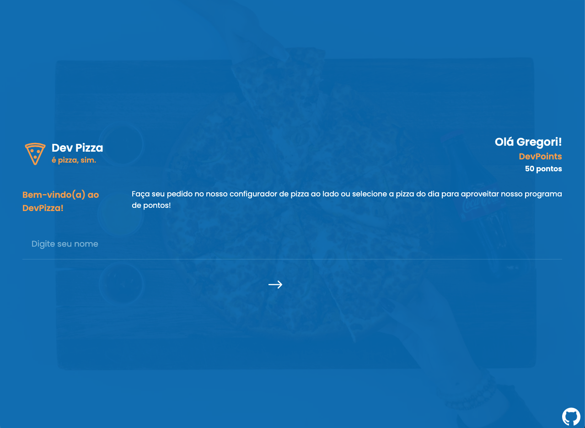
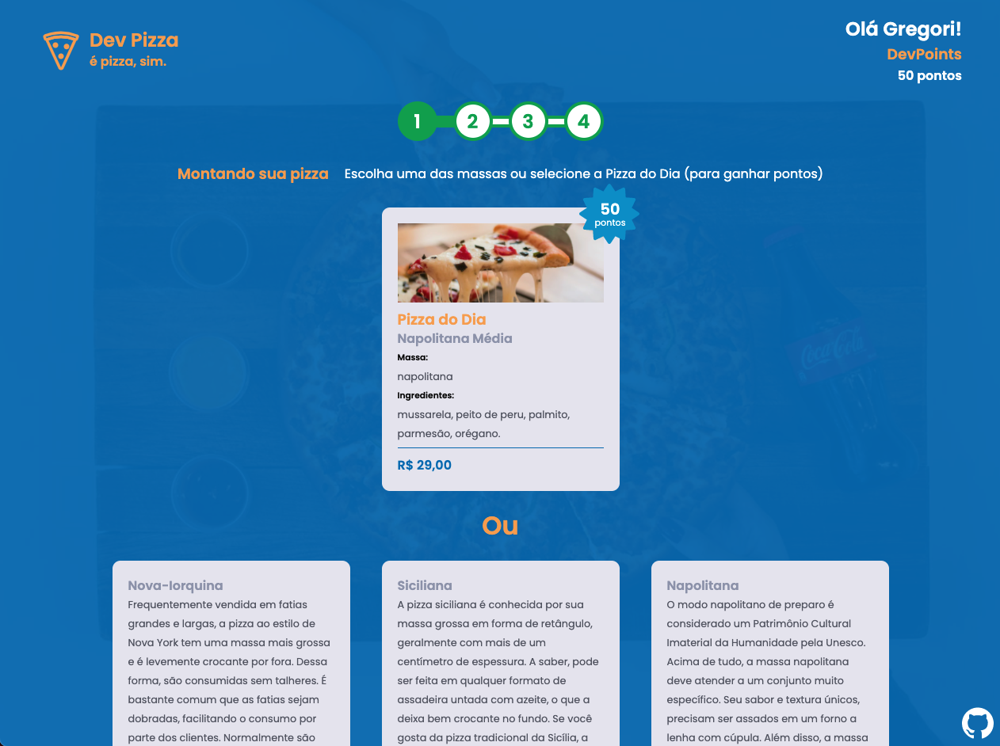

<h3 align="center">DevPizza</h3>

<div align="center">

[]()
[](/LICENSE)

</div>

---

<p align="center"> This app is an Web App called DevPizza.
<br>
It's a web app made to be a online pizza purchase system.
    <br>
</p>

## 📝 Table of Contents

- [About](#about)
- [Getting Started](#getting_started)
- [Usage](#usage)
- [Built Using](#built_using)
- [Authors](#authors)

## 🧐 About <a name = "about"></a>

This project was made to be a React application to your purchase a pizza.

## 🏁 Getting Started <a name = "getting_started"></a>

These instructions will get you a copy of the project up and running on your local machine for development and testing purposes.

### Prerequisites

- [Yarn](https://yarnpkg.com/lang/en/) - Package Manager

### Installing

A step by step series of examples that tell you how to get a development env running.

### Cloning Repo

```
$ git clone https://github.com/gregorispielmann/devpizza.git
```

### Demo

<div style="display: flex;">




</div>

### How it runs?

```
$ yarn
To install all dependencies

$ yarn start
To run the app in your navigator
```

## 🎈 Usage <a name="usage"></a>

You will made your puchase with your own choices with the pizza configurator or the day flavor.

## ⛏️ Built Using <a name = "built_using"></a>

- [React](https://pt-br.reactjs.org/) - Web Framework
- [Styled Components](https://www.styled-components.com/) - CSS in Javascript library
- and others

## ✍️ Authors <a name = "authors"></a>

- [@gregorispielmann](https://github.com/gregorispielmann) - React App development
